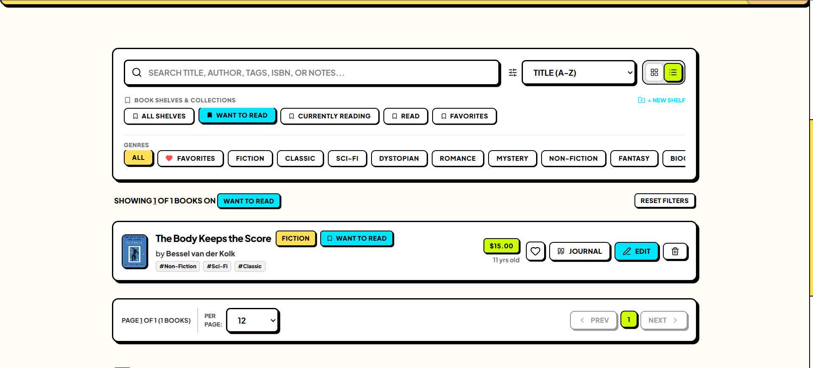
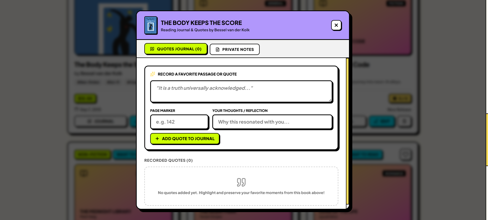
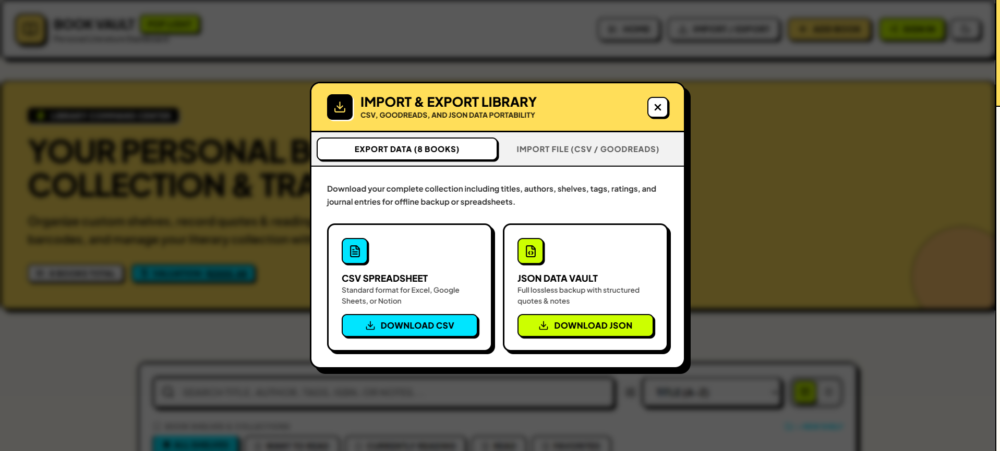
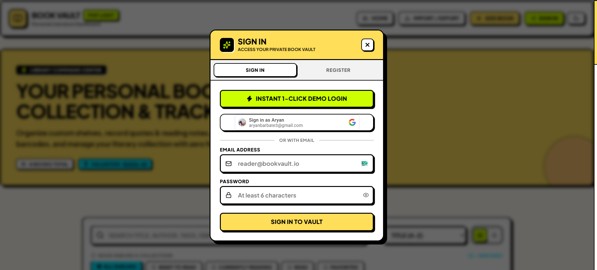

# 📚 Book Vault — Neubrutalism Literature Management System

<div align="center">


**A high-energy, full-stack literature tracking platform engineered with the MERN stack and styled in an electric Neubrutalist aesthetic.**

[Features](#-key-features) • [Visual Showcase](#-visual-showcase) • [Architecture](#-project-architecture) • [Tech Stack](#-technology-stack) • [Getting Started](#-getting-started) • [Cloud Deployment](#-cloud-deployment) • [API Reference](#-api-endpoints)

</div>

---

## ⚡ Overview

**Book Vault** is a full-featured personal library organizer and literature valuation engine. Built on a modern decoupled **Express 5 / MongoDB Atlas** backend and a **React 19 / Vite / Tailwind CSS v4** frontend, it elevates personal collection tracking with a bold **Neubrutalist design system** — marked by heavy 3px black borders, hard drop shadows, tactile micro-interactions, vibrant retro colors, and seamless Pop Light & Cyber Dark themes.

Whether cataloging physical volumes via **HTML5 camera barcode scanning**, synchronizing ISBN metadata through **Google Books & OpenLibrary**, recording insightful reading notes in the **Quotes Journal**, or migrating existing libraries via **CSV, Goodreads & JSON**, Book Vault is engineered for zero-friction literature management.

---

## 📸 Visual Showcase

### 1. Library Command Center & Hero Banner
High-contrast hero banner rendering real-time portfolio metrics, valuation counter, instant full-text search, and quick shelf navigation.


---

### 2. Interactive Browsing: Grid View vs. Compact List View
Toggle seamlessly between an expansive, visual **Book Card Grid** and a dense, data-rich **Compact List View** with single-click actions.

<p align="center">
  
  
</p>

* **Grid View**: Vibrant book cards with live star ratings, genre tags, cover art, quick favorites toggle, and action buttons.
* **List View**: Dense horizontal entries displaying cover thumbnails, publication age badges (*"11 yrs old"*, *"New Release"*), prices, tags, and direct journal triggers.

---

### 3. Custom Shelves & Dynamic Multi-Filtering
Organize books into default shelves (*"Want to Read"*, *"Currently Reading"*, *"Read"*, *"Favorites"*) or create custom user shelves. Filter instantly by genre pills and shelf categories with live match counters and single-click filter resets.



---

### 4. Book Ingestion & Auto-Fill: Add vs. Edit Modals
Streamlined data entry with automated ISBN lookups, camera barcode scanning, and live OpenLibrary/Google Books cover art retrieval.

<p align="center">
  
  
</p>

* **Add Book Modal**: Auto-populate title, author, description, page count, and cover preview from an ISBN scan or input.
* **Edit Book Modal**: Update shelf placements, custom tags, cover art URLs, Base64 uploads, ratings, and valuation prices.

---

### 5. Quotes Journal & Private Study Notes
Preserve your favorite excerpts, memorable passages, page markers, and personal reflections for each volume, backed by a dedicated private notes tab.



---

### 6. Data Portability & Multi-User Authentication
Seamless data migration paired with flexible authentication options for personal privacy and collaborative demoing.

<p align="center">
  
  
</p>

* **Data Portability**: Lossless **JSON Data Vault** export, **CSV Spreadsheet** download for Excel/Notion, and **Goodreads / CSV Import** with automatic schema mapping.
* **Authentication**: Multi-tier login supporting **1-Click Instant Demo Login**, **Google OAuth**, and secure **Email / Password** registration with JWT tokens.

---

### 7. Collection Insights & Server-Side Pagination
Real-time calculated analytics dashboard paired with configurable server-side pagination (6, 12, 24, 48 items per page).


* **Collection Size**: Total volume count and read progress tracker.
* **Valuation Total**: Cumulative portfolio value and average price per book.
* **Top Category**: Automatically calculated dominant genre in your library.
* **Saved Quotes**: Total journal highlights and starred favorite titles.

---

## ✨ Key Features (v2.0)

| Feature | Description |
|---|---|
| **🔐 Multi-User Authentication & Tenancy** | Email/password registration and login with JWT, Google OAuth integration, secure password hashing, and user-scoped collections with zero-friction 1-click demo access. |
| **🎨 Real Cover Art & File Uploads** | High-fidelity cover rendering in grid and list views, image file upload support (Base64), image URL input, and automated cover population from ISBN lookups. |
| **📱 ISBN Auto-Fill & Barcode Scanner** | Instant metadata lookup from Google Books & OpenLibrary APIs to auto-fill title, author, description, publish date, page count, and genre; plus an in-browser HTML5 camera barcode scanner. |
| **📚 Custom Shelves & Multi-Tagging** | User-defined custom shelves (*"Want to Read"*, *"Currently Reading"*, *"Read"*, *"Favorites"*, and custom lists like *"Summer 2026"*) alongside flexible tagging chips. |
| **📝 Quotes & Reading Journal** | Dedicated per-book reading journal with page markers, blockquotes, and personal reflections, plus full-length private study notes. |
| **🔄 CSV, Goodreads & JSON Import/Export** | Export your entire library as CSV or JSON, and import from standard CSVs or Goodreads library export files with intelligent schema mapping. |
| **📄 Server-Side Pagination** | Backend limit/skip pagination with page number navigation, page size selectors (6, 12, 24, 48), and server-side filtering. |
| **🎨 Electric Neubrutalism UI** | Heavy 3px solid black borders, hard drop shadows (`shadow-[3px_3px_0px_#000]`), retro color accents (`#FFDE59` Canary, `#00F0FF` Cyan, `#FF54B0` Pink, `#CCFF00` Lime), and tactile hover micro-interactions. |
| **🌓 Dual Themes: Pop Light & Cyber Dark** | Full theme switching with dynamic `data-theme` document switching and high-contrast color token mapping. |
| **🚀 Cloud Production Ready** | Configured for one-click deployment on **Render** (API backend with self-ping keep-alive) and **Vercel** (SPA frontend). |

---

## 🏗️ Project Architecture

```
Book-Management-System/
├── Client/                         # Frontend (React 19 + Vite + Tailwind CSS v4)
│   ├── public/
│   │   ├── favicon.svg             # Neubrutalism vector favicon
│   │   ├── favicon.png             # Raster favicon
│   │   └── favicon.ico             # Legacy favicon
│   ├── src/
│   │   ├── components/             # Modular UI components
│   │   │   ├── AuthModal.jsx       # 1-Click demo, Google OAuth & email login
│   │   │   ├── BarcodeScannerModal.jsx # Camera barcode scanner (HTML5 QR/Barcode)
│   │   │   ├── BookCard.jsx        # Neubrutalist grid book card
│   │   │   ├── BookForm.jsx        # Add & Edit modal with ISBN auto-fill
│   │   │   ├── BookJournalModal.jsx# Quotes journal & private notes modal
│   │   │   ├── BookList.jsx        # Dense horizontal list view
│   │   │   ├── Header.jsx          # Top brand bar, theme toggle & nav actions
│   │   │   ├── Home.jsx            # Search, shelf navigation & genre filter bar
│   │   │   ├── ImportExportModal.jsx# CSV / JSON export & Goodreads import
│   │   │   ├── PaginationControls.jsx # Server pagination bar & page size dropdown
│   │   │   ├── Stats.jsx           # 4-card collection insights & valuation summary
│   │   │   └── ToastNotification.jsx# Animated feedback notifications
│   │   ├── context/
│   │   │   └── AuthContext.jsx     # JWT & user authentication state
│   │   ├── hooks/
│   │   │   └── useToasts.js        # Toast dispatch and auto-dismiss hook
│   │   ├── constants/
│   │   │   └── genres.js           # Genre taxonomy & color badge tokens
│   │   ├── utils/                  # Date helpers, formatters, and CSV parsers
│   │   ├── App.jsx                 # Main state coordinator & CRUD handlers
│   │   ├── main.jsx                # React DOM root entry
│   │   └── index.css               # Neubrutalism utility CSS rules
│   ├── axiosInstance.js            # Environment-aware Axios client
│   ├── vercel.json                 # Vercel SPA routing rewrites
│   ├── .env.example                # Frontend environment template
│   ├── README.md                   # Client-specific documentation
│   └── package.json
│
├── Server/                         # Backend (Node.js + Express 5 + MongoDB Atlas)
│   ├── controllers/
│   │   ├── authController.js       # Auth handlers (JWT, Google, demo)
│   │   └── bookController.js       # Book CRUD, quotes, pagination, ISBN lookup
│   ├── middleware/
│   │   └── auth.js                 # JWT bearer token verification
│   ├── models/
│   │   ├── book.js                 # Mongoose schema for book records
│   │   └── user.js                 # Mongoose schema for user accounts & shelves
│   ├── routes/
│   │   ├── authRouter.js           # Express routes for /auth
│   │   └── bookRouter.js           # Express routes for /books
│   ├── database.js                 # Resilient MongoDB Atlas connection manager
│   ├── keepAlive.js                # Self-ping keep-alive service for Render
│   ├── index.js                    # Express app entry & middleware mounting
│   ├── seed.js                     # Sample library seed script
│   ├── .env.example                # Backend environment template
│   ├── README.md                   # Backend-specific documentation
│   └── package.json
│
├── utils/                          # High-resolution UI screenshots & assets
│   ├── dashboard-hero.png          # Command center & hero metrics
│   ├── auth-modal.png              # Multi-tier authentication modal
│   ├── import-export-modal.png     # CSV/JSON export & Goodreads import modal
│   ├── books-grid-view.png         # Neubrutalist book cards grid view
│   ├── edit-book-modal.png         # Edit modal with OpenLibrary cover fetch
│   ├── reading-journal-modal.png   # Reading journal & quotes modal
│   ├── add-book-modal.png          # Add book modal with ISBN auto-fill
│   ├── books-list-view.png         # Dense horizontal list view
│   ├── collection-insights.png     # 4-card analytics & pagination controls
│   └── shelf-filtering.png         # Active shelf filter & match count
│
├── render.yaml                     # Render Blueprint infrastructure specification
└── README.md                       # Project root documentation
```

---

## 🛠️ Technology Stack

| Domain | Technology | Description |
|---|---|---|
| **Frontend** | [React 19](https://react.dev/) | Modern component architecture, hooks & Concurrent Mode |
| | [Vite 8](https://vite.dev/) | Sub-millisecond HMR & optimized production bundling |
| | [Tailwind CSS v4](https://tailwindcss.com/) | Modern styling engine with custom Neubrutalism design tokens |
| | [Lucide React](https://lucide.dev/) | Consistent, crisp iconography |
| | [Axios](https://axios-http.com/) | Promise-based HTTP client with dynamic baseURL resolution |
| | [HTML5 Barcode Detection](https://developer.mozilla.org/en-US/docs/Web/API/Barcode_Detection_API) | In-browser camera scanning for physical ISBN barcodes |
| **Backend** | [Node.js](https://nodejs.org/) (v18+) | Asynchronous event-driven JavaScript runtime |
| | [Express.js 5](https://expressjs.com/) | Minimalist RESTful API routing framework |
| | [Mongoose 9](https://mongoosejs.com/) | Elegant Object Data Modeling (ODM) for MongoDB |
| | [JSON Web Tokens (JWT)](https://jwt.io/) | Stateless authentication & authorization |
| | [bcryptjs](https://www.npmjs.com/package/bcryptjs) | Salted password hashing |
| | [Google Auth Library](https://www.npmjs.com/package/google-auth-library) | Server-side Google OAuth credential verification |
| **Database** | [MongoDB Atlas](https://www.mongodb.com/atlas) | Multi-cloud managed NoSQL document database |
| **Deployment** | [Vercel](https://vercel.com/) | Global edge hosting for the client SPA |
| | [Render](https://render.com/) | Fully-managed cloud container hosting for the API |

---

## 🚀 Getting Started

### Prerequisites

Ensure you have the following installed locally:
- [Node.js](https://nodejs.org/) (version 18.0 or newer)
- [npm](https://www.npmjs.com/) (version 9.0 or newer)
- A [MongoDB Atlas](https://www.mongodb.com/atlas) connection URI (or local MongoDB instance)

### 1. Clone the Repository

```bash
git clone https://github.com/Aryan-Barbate/Book-Management-System.git
cd Book-Management-System
```

### 2. Backend Setup

```bash
# Navigate to the Server directory
cd Server

# Install dependencies
npm install

# Create environment configuration
cp .env.example .env
```

Edit `Server/.env` with your credentials:

```env
PORT=3000
MONGODB_URI=your_mongodb_atlas_connection_string
DB_NAME=Book-Management
JWT_SECRET=your_super_secret_jwt_key
GOOGLE_CLIENT_ID=your_google_oauth_client_id_optional
RENDER_EXTERNAL_URL=http://localhost:3000
```

Start the backend server:

```bash
# Development mode with nodemon auto-restart
npm run dev

# Or production mode
npm start
```

The API will be live at: `http://localhost:3000`

### 3. Frontend Setup

Open a new terminal window:

```bash
# Navigate to the Client directory
cd Client

# Install dependencies
npm install

# Create client environment configuration
cp .env.example .env
```

Edit `Client/.env` (defaults to local backend):

```env
VITE_API_URL=http://localhost:3000
```

Start the Vite development server:

```bash
npm run dev
```

Open your browser at: `http://localhost:5173`

---

## 🌐 Cloud Deployment

### Deploying the Backend on Render
1. Create a new **Web Service** on [Render](https://dashboard.render.com/) linked to this repository.
2. Set **Root Directory** to `Server`.
3. Set **Build Command** to `npm install` and **Start Command** to `npm start`.
4. Set **Health Check Path** to `/ping` (or deploy automatically via the included [`render.yaml`](render.yaml) Blueprint).
5. Add the required environment variables:
   - `MONGODB_URI`: *Your MongoDB Atlas connection string*
   - `DB_NAME`: `Book-Management`
   - `JWT_SECRET`: *A secure random string*
   - `RENDER_EXTERNAL_URL`: `https://your-service.onrender.com`
6. **24/7 Keep-Alive**: Free-tier Render services sleep after 15 minutes of inactivity. Book Vault includes a built-in self-ping in [`Server/keepAlive.js`](Server/keepAlive.js) that targets `RENDER_EXTERNAL_URL/ping` every 14 minutes. You can also add a free uptime ping via [cron-job.org](https://cron-job.org/) or [UptimeRobot](https://uptimerobot.com/).

### Deploying the Frontend on Vercel
1. Import your repository into [Vercel](https://vercel.com/).
2. Set **Root Directory** to `Client`.
3. Framework Preset: `Vite` (automatically detected).
4. Add environment variable:
   - `VITE_API_URL`: `https://your-backend.onrender.com` *(no trailing slash)*
5. Click **Deploy**. The included [`vercel.json`](Client/vercel.json) handles client-side SPA routing automatically.

---

## 📡 API Endpoints

### Health & Keep-Alive

| Method | Endpoint | Description |
|---|---|---|
| `GET` | `/` | API status check |
| `GET` / `HEAD` | `/ping` | Lightweight uptime ping (zero DB queries, cache disabled) |

### Authentication (`/auth`)

| Method | Endpoint | Description | Payload Sample |
|---|---|---|---|
| `POST` | `/auth/register` | Create a new user account | `{ "name": "...", "email": "...", "password": "..." }` |
| `POST` | `/auth/login` | Log in with email and password | `{ "email": "...", "password": "..." }` |
| `POST` | `/auth/google` | Verify Google OAuth credential token | `{ "credential": "..." }` |
| `POST` | `/auth/demo` | Instant 1-click guest/demo login | None |
| `GET` | `/auth/me` | Fetch authenticated user profile | Bearer Token in Header |
| `PUT` | `/auth/shelves` | Synchronize custom shelves list | `{ "customShelves": ["Want to Read", "Summer 2026"] }` |

### Books (`/books`)

| Method | Endpoint | Description | Payload / Query Parameters |
|---|---|---|---|
| `GET` | `/books` | Retrieve paginated books with filters | `?page=1&limit=12&search=...&genre=...&shelf=...&sortBy=...` |
| `POST` | `/books` | Create a new book record | `{ "bookName": "...", "bookAuthor": "...", "bookPrice": 15, "coverUrl": "...", "shelf": "Want to Read" }` |
| `POST` | `/books/import` | Bulk import books (CSV/Goodreads) | `{ "books": [ { "bookName": "...", "bookAuthor": "..." } ] }` |
| `GET` | `/books/lookup/:isbn` | Query Google Books / OpenLibrary by ISBN | None |
| `GET` | `/books/:id` | Get book details by ID | None |
| `PUT` | `/books/:id` | Update book details | `{ "shelf": "Read", "rating": 5, "isFavorite": true }` |
| `DELETE` | `/books/:id` | Delete a book by ID | None |
| `POST` | `/books/:id/quotes` | Add quote to reading journal | `{ "quote": "...", "page": 42, "note": "..." }` |
| `DELETE` | `/books/:id/quotes/:quoteId` | Remove quote from journal | None |
| `PUT` | `/books/:id/notes` | Save private study notes | `{ "notes": "..." }` |

---

## 📄 License

This project is licensed under the [ISC License](LICENSE).
