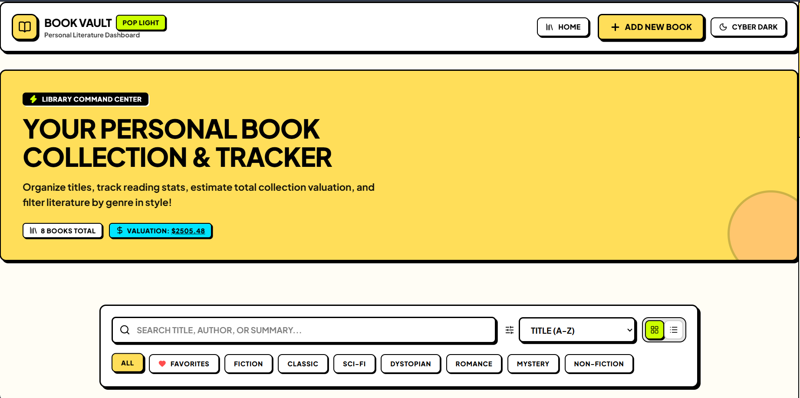
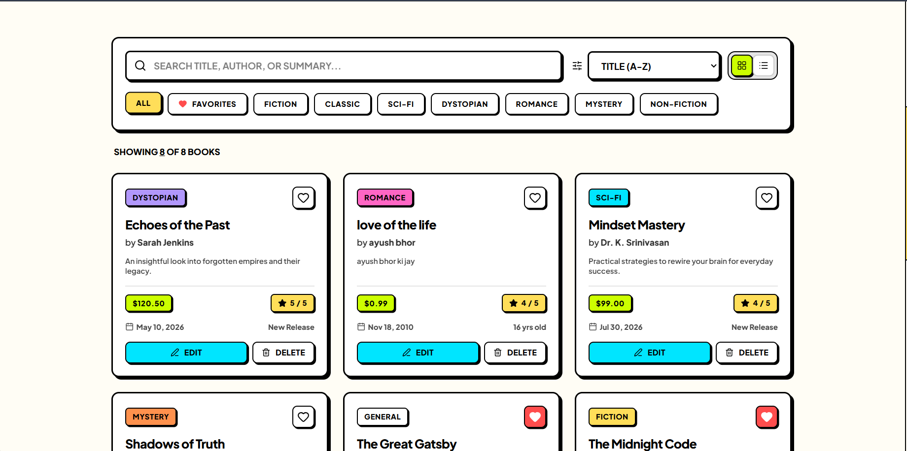
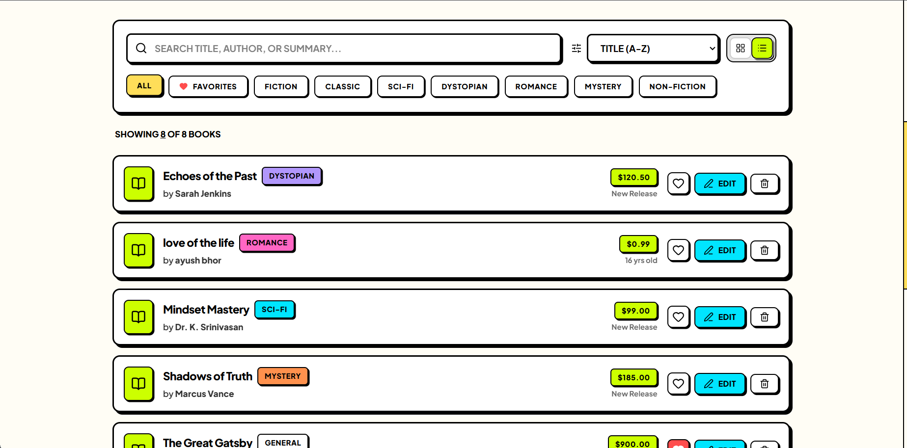
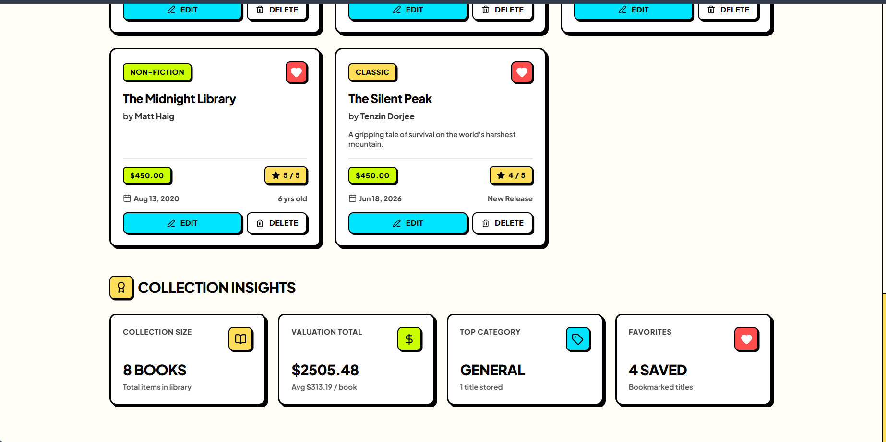
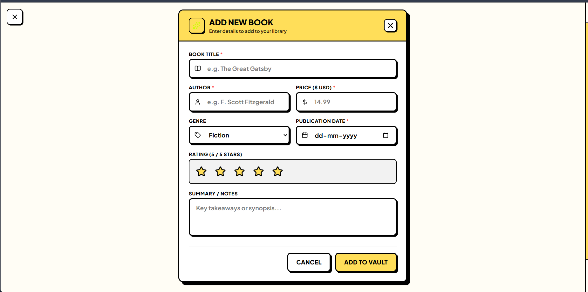
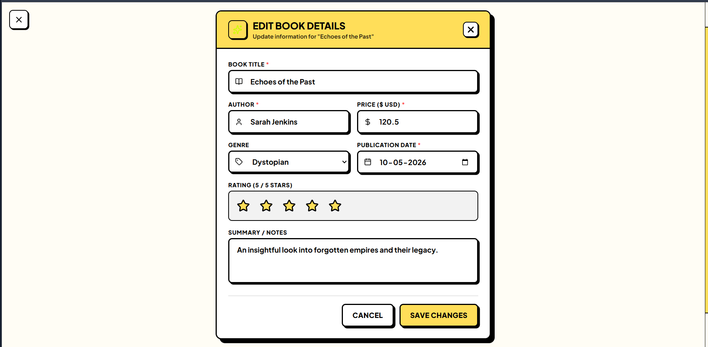
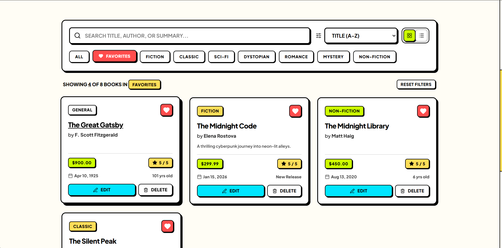

# 📚 Book Vault — Neubrutalism Book Management System

<div align="center">


**A high-energy, full-stack literature tracking platform engineered with the MERN stack and styled in an electric Neubrutalist aesthetic.**

[Features](#-key-features) • [Screenshots](#-visual-showcase) • [Architecture](#-project-architecture) • [Getting Started](#-getting-started) • [Deployment](#-deployment) • [API Reference](#-api-endpoints)

</div>

---

## ⚡ Overview

**Book Vault** is a personal library management and literature valuation dashboard. Built with a decoupled **Express/MongoDB** backend and a **React 19/Vite** frontend, it pairs robust CRUD capabilities with an eye-catching Neubrutalism design system — featuring heavy outlines, bold offset box shadows, vibrant retro-pop colors, and an interactive Cyber Dark mode.

---

## 📸 Visual Showcase

### 1. Dashboard & Command Center
High-contrast hero banner displaying active collection metrics, valuation counter, search bar, and genre filter pills.



### 2. Interactive Book Grid View
Rich book cards featuring genre tags, author credits, synopsis previews, prices, star ratings, and quick actions.



### 3. Compact List View
Toggle into a clean horizontal list view for rapid browsing across large collections.



### 4. Collection Insights & Valuation
Real-time calculated stats including collection count, cumulative portfolio value, top category, and saved favorites.



### 5. Add & Edit Modals
Neubrutalist modal forms complete with live interactive star ratings, date pickers, category dropdowns, and form validation.

<p align="center">
  
  
</p>

### 6. Favorites Filter
Instant one-click bookmarking of favorite titles with quick filter isolation.



---

## ✨ Key Features

- **🎨 Electric Neubrutalism UI**: Heavy 3px solid black borders, hard drop shadows (`shadow-[3px_3px_0px_#000]`), retro color accents (vibrant yellow `#FFDE59`, cyan, hot pink, lime), and tactile hover micro-interactions.
- **🌓 Cyber Dark & Pop Light Modes**: Full theme switching with dynamic `data-theme` switching and high-contrast color token mapping.
- **📖 Complete CRUD Lifecycle**: Add new books, view catalog, edit details inline, and delete books with instant optimistic state synchronization.
- **💰 Automatic Collection Valuation**: Computes aggregate monetary valuation of your entire library in real-time.
- **🔍 Multi-Faceted Filter & Search**: Instant client-side search across title, author, and description, with A-Z / price / rating sorting and genre pill filtering.
- **❤️ Favorites Bookmarking**: Persistent favorite toggles to keep your top reads within reach.
- **📱 Fluid Responsiveness**: Designed from the ground up for mobile, tablet, and widescreen desktop layouts.
- **🚀 Cloud Production Ready**: Fully configured for one-click deployment on **Render** (API backend) and **Vercel** (SPA frontend).

---

## 🏗️ Project Architecture

```
Book-Management-System/
├── Client/
│   └── Book-management/            # Frontend (React 19 + Vite + Tailwind v4)
│       ├── public/
│       │   ├── favicon.svg         # Neubrutalism vector favicon
│       │   ├── favicon.png         # Raster favicon
│       │   └── favicon.ico         # Legacy favicon
│       ├── src/
│       │   ├── components/         # UI components (Header, BookCard, BookForm, etc.)
│       │   ├── hooks/              # Custom hooks (useToasts)
│       │   ├── constants/          # Static genre tags and themes
│       │   ├── utils/              # Helper utilities
│       │   ├── App.jsx             # Root application orchestrator
│       │   ├── main.jsx            # React root entry
│       │   └── index.css           # Neubrutalist utility CSS rules
│       ├── axiosInstance.js        # Configured Axios client with dynamic baseURL
│       ├── vercel.json             # Vercel SPA routing rewrites
│       ├── .env.example            # Sample client environment variables
│       └── package.json
│
├── Server/                         # Backend (Node.js + Express 5 + MongoDB)
│   ├── controllers/                # Request handlers (bookController.js)
│   ├── models/                     # Mongoose schemas (book.js)
│   ├── routes/                     # REST route definitions (bookRouter.js)
│   ├── database.js                 # MongoDB connection handler
│   ├── index.js                    # Express app entry & PORT listener
│   ├── .env.example                # Sample backend environment variables
│   └── package.json
│
├── utils/                          # High-resolution screenshots & UI assets
│   ├── dashboard-hero.png
│   ├── books-grid-view.png
│   ├── books-list-view.png
│   ├── collection-insights.png
│   ├── add-book-modal.png
│   ├── edit-book-modal.png
│   └── favorites-filter.png
│
├── render.yaml                     # Render Blueprint infrastructure specification
└── README.md                       # Main project documentation
```

---

## 🛠️ Technology Stack

| Domain | Technology | Description |
|---|---|---|
| **Frontend** | [React 19](https://react.dev/) | Component architecture & modern hooks |
| | [Vite 8](https://vite.dev/) | Lightning-fast bundler & development environment |
| | [Tailwind CSS v4](https://tailwindcss.com/) | Modern CSS framework for custom styling tokens |
| | [React Router v7](https://reactrouter.com/) | Client-side routing with clean URL support |
| | [Lucide React](https://lucide.dev/) | High-clarity iconography |
| | [Axios](https://axios-http.com/) | HTTP client with automatic base URL detection |
| **Backend** | [Node.js](https://nodejs.org/) | Asynchronous JavaScript runtime |
| | [Express.js 5](https://expressjs.com/) | RESTful API routing framework |
| | [Mongoose 9](https://mongoosejs.com/) | Object Data Modeling (ODM) for MongoDB |
| | [Dotenv](https://www.npmjs.com/package/dotenv) | Secure environment variable configuration |
| | [CORS](https://www.npmjs.com/package/cors) | Cross-origin resource sharing middleware |
| **Database** | [MongoDB Atlas](https://www.mongodb.com/atlas) | Multi-cloud document database |
| **Hosting** | [Vercel](https://vercel.com/) | Edge hosting for the React single-page application |
| | [Render](https://render.com/) | Managed cloud hosting for the Node.js API |

---

## 🚀 Getting Started

### Prerequisites

Ensure you have installed:
- [Node.js](https://nodejs.org/) (version 18.0 or newer)
- [npm](https://www.npmjs.com/) (version 9.0 or newer)
- A [MongoDB Atlas](https://www.mongodb.com/atlas) cluster connection URI

### 1. Clone the Repository

```bash
git clone https://github.com/Aryan-Barbate/Book-Management-System.git
cd Book-Management-System
```

### 2. Backend Setup

```bash
# Navigate to Server directory
cd Server

# Install dependencies
npm install

# Create environment configuration
cp .env.example .env
```

Open `Server/.env` and supply your MongoDB Atlas credentials:

```env
PORT=3000
MONGODB_URI=your_mongodb_atlas_connection_string
DB_NAME=Book-Management
```

Start the backend server:

```bash
# Production mode
npm start

# Or development mode (with nodemon live-reload)
npm run dev
```

The server will launch at: `http://localhost:3000`

### 3. Frontend Setup

In a new terminal window:

```bash
# Navigate to Client directory
cd Client/Book-management

# Install dependencies
npm install

# Create environment configuration (optional for local dev)
cp .env.example .env
```

Start the Vite development server:

```bash
npm run dev
```

The frontend will launch at: `http://localhost:5173`

---

## 🌐 Cloud Deployment

### Deploying the Backend on Render
1. Create a new **Web Service** on [Render](https://dashboard.render.com/) connected to your repo.
2. Set **Root Directory** to `Server`.
3. Set **Build Command** to `npm install` and **Start Command** to `npm start`.
4. Add the environment variables:
   - `MONGODB_URI`: *Your MongoDB connection string*
   - `DB_NAME`: `Book-Management`
5. Note your live backend URL (e.g., `https://book-management-api.onrender.com`).

### Deploying the Frontend on Vercel
1. Import your repository on [Vercel](https://vercel.com/).
2. Set **Root Directory** to `Client/Book-management`.
3. Framework Preset: `Vite`.
4. Add the environment variable:
   - `VITE_API_URL`: `https://<your-backend>.onrender.com` *(without trailing slash)*
5. Click **Deploy**.

---

## 📡 API Endpoints

All book resource routes are accessible at `/books`:

| Method | Endpoint | Description | Payload Sample |
|---|---|---|---|
| `GET` | `/` | API Health Check | `{"status":"ok"}` |
| `GET` | `/books` | Retrieve all books | None |
| `POST` | `/books` | Create a new book entry | `{ "bookName": "...", "bookAuthor": "...", "bookPrice": 19.99, ... }` |
| `PUT` | `/books/:id` | Update an existing book | `{ "bookPrice": 24.99, "isFavorite": true }` |
| `DELETE` | `/books/:id` | Delete a book by ID | None |

---

## 📄 License

This project is licensed under the [ISC License](LICENSE).
